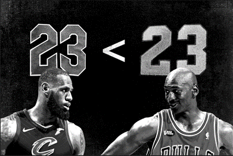

<center>

{width=100%}

</center>

# Statistically Analyzing the G.O.A.T. Debate {.tabset}

## Abstract

### Overall Purpose of My Study

The Greatest of All Time (G.O.A.T.) discussion is an age old debate typically involving superstars LeBron James and Michael Jordan who each dominated in their respective eras of the NBA. Each considered the greatest of THEIR time, fans have long contested which is the greatest of ALL time. This is my attempt to finally settle this debate with statistics!

### Basic Design of My Study

For this analysis, I performed a Two Sample t-test (Independent Samples). The observation of interest is points-per-game scored by each player during their respective careers. The basis of my study is to simply determine if the mean points scored per game by both players differ significantly, and therefore determine which player made the larger impact.

### Major Findings + Short Summary of My Study

As an avid fan of sports and the NBA in particular, my favorite player between the two is Michael Jordan. However, I approached this analysis fairly and objectively to statistically prove which player is the greatest of all time based on the significance of mean points-per-game scored. By conducting the Two Sample t-test, it was determined that Michael Jordan indeed had a significantly higher mean points-per-game scored over his career than LeBron James currently has. With a p-value (0.00) less than any reasonable alpha level, it is determined that Michael Jordan is officially the G.O.A.T. of professional basketball!


-----------------------------------------------------------------------

## Introduction

### Question of Interest

LeBron James vs. Michael Jordan
who is the Greatest of All Time (G.O.A.T)?

### Why Should You Be Interested?

There can be many greats, but only one absolute greatest of all time. For my NBA fans, this is a fun debatable topic that I felt would be fun to analyze statistically.

### How I Plan to Address this Question

I will utilize career stats for both LeBron James and Michael Jordan to perform a Two Sample t-test.

-----------------------------------------------------------------------

## Personal Information

<center>

{width=30%}

</center>

Hello! My name is Derrick Joyce and I am a graduating senior with a Bachelor of Science in Computer Engineering with a minor in Mathematical Sciences. I am an avid sports fan which was my inspiration for this topic. I plan to start graduate school this upcoming fall to pursue a Masters in Robotics!

-----------------------------------------------------------------------


# Data Management

## Data Links
[Michael Jordan Career Stats](https://www.basketball-reference.com/players/j/jordami01.html)

[LeBron James Career Stats](https://www.basketball-reference.com/players/j/jamesle01.html)

## Data Collection Method

From the above links, I copied the statistics for each game that the player played. I ignored games where the player was injured or inactive because they are not physically contributing to the game.

## Import Raw Data

```{r echo=FALSE, include=FALSE}
library(tidyverse)
library(ggpubr)
library(readxl)
library(rstatix)
library(DT)
```

### LeBron James Career Stats:
```{r message=FALSE}
lebron = read_excel("LEBRON_STATS.xlsx", skip = 1)

datatable(lebron)
```


### Michael Jordan Career Stats:
```{r message=FALSE}
mj = read_excel("MJ_STATS.xlsx", skip = 1)

datatable(mj)
```


## Select Game Number and PTS (Points)

### LeBron James Points Per Game (PPG)

```{r warning=FALSE}

#Select Game_Number and PTS
lebron_pts = lebron %>%
  select(G, PTS) %>%
  na.omit() %>%
  summarise(Game_Number = G,
            LEBRON_PTS = PTS)


datatable(lebron_pts)


```

### Michael Jordan Points Per Game (PPG)

```{r warning=FALSE}

#Select Game_Number and PTS
mj_pts = mj %>%
  select(G, PTS) %>%
  na.omit() %>%
  summarise(Game_Number = G,
            MJ_PTS = PTS)

datatable(mj_pts)

```


## Join by Game Number To Get Final Data Table


```{r}
#inner join to include only the games that each played
pts = inner_join(mj_pts, lebron_pts, by = "Game_Number") %>%
  select(-Game_Number)

datatable(pts)
```


# Descriptive Statistics

## Pivot Data

```{r warning=FALSE}

#Pivot the data
pts_pivot = pts %>%
  pivot_longer("LEBRON_PTS":"MJ_PTS",names_to = "Player", values_to = "PTS")

datatable(pts_pivot)
```

## Summary Statistics
```{r}

#Gather summary statistics
pts_summary = pts_pivot %>%
  group_by(Player) %>%
  summarise(n = n(),
            mean = mean(PTS, na.rm = TRUE),
            sd = sd(PTS, na.rm = TRUE))

knitr::kable(pts_summary)

```

This study analyzes 1020 games played by LeBron James and Michael Jordan. The mean points-per-game scored by LeBron is approximately 27.18 and Michael's is 30.22. From a surface level view, it is clear that Michael had a higher average points-per-game scored, but the question remains: is it a statistically significant difference? In the context of a basketball game, a 3 point deficit is a small margin. However, in the context of statistics, the significance is yet to be determined. Next we will visualize the data to get a better understanding of the distribution.


## Data Visualizations

### Histogram

```{r}

#histogram
hist <- pts_pivot %>%
  ggplot(mapping=aes(x = PTS, fill=Player)) +
  geom_histogram(binwidth = 5) 

hist

```

From the histogram, it is clear that although Michael Jordan has a slightly higher mean points-per-game than LeBron James, LeBron has a much higher point total than Michael throughout the sample 1020 games. This raises the question: How could LeBron have more total points but a smaller mean overall? This is because the data analyzes points-per-game, not total points scored. This indicates that LeBron may have many outliers (games where he scored much more or much less than normal). Therefore we can conclude that LeBron has scored much more points overall, but on a per-game basis, Michael Jordan has the higher average point total.


### Boxplot

```{r}
# boxplot
bp <- pts_pivot %>%
  ggplot(mapping=aes(x=PTS, fill=Player)) +
  geom_boxplot(outlier.color = "#F56600", 
               outlier.size = 3.0) 
bp
```

A similar conclusion can be drawn from the boxplot. What we can clearly see is the high number of outliers for LeBron's point totals which could be skewing the data. These outliers are reasonable within the context of basketball because player performance varies throughout the season due to numerous external factors. However, it is still clear that Michael Jordan retains the higher mean points-per-game. This is important to note because LeBron James played more games total than Michael Jordan so analyzing mean points-per-game is a more accurate representation than simply total points scored.

### QQPlot

```{r}
# qq plot
ggqqplot(pts_pivot, x="PTS", facet.by = "Player")

```

The QQPlot confirms that both datasets follow an approximiately normal distribution. There is insufficient evidence to suggest otherwise.

------------------------------

# Analysis

## Perform Two Sample T Test

$$ H_0: \mu_1 = \mu_2 $$

$$ H_A: \mu_1 \ne \mu_2 $$

```{r}

# perform t test
test <- pts_pivot %>% 
  t_test(PTS ~ Player) %>%
  add_significance()

# nice print of output
knitr:: kable(test, align="c", format = "html") %>%
  kableExtra::kable_styling(full_width = FALSE)

```
Out of the sample 1020 games analyzed by each player, I performed a hypothesis test to determine if the mean points-per-game scored by Michael Jordan and LeBron James were significantly different in a statistical point-of-view. The resulting p-value is 0.00 which is much lower than a reasonable alpha level.

# Summary

A two-sample t-test was computed to determine whether the population mean points-per-game by Michael Jordan was significantly higher from the population mean points-per-game by LeBron James.

Since the p-value (0) is less than any reasonable alpha level, we reject our null hypothesis. There IS sufficient evidence to suggest that the population mean points-per-game scored by Michael Jordan is significantly greater than the population mean points-per-game scored by LeBron James.

<center>

{}

</center>

# References

https://www.basketball-reference.com/players/j/jordami01.html

https://www.basketball-reference.com/players/j/jamesle01.html
